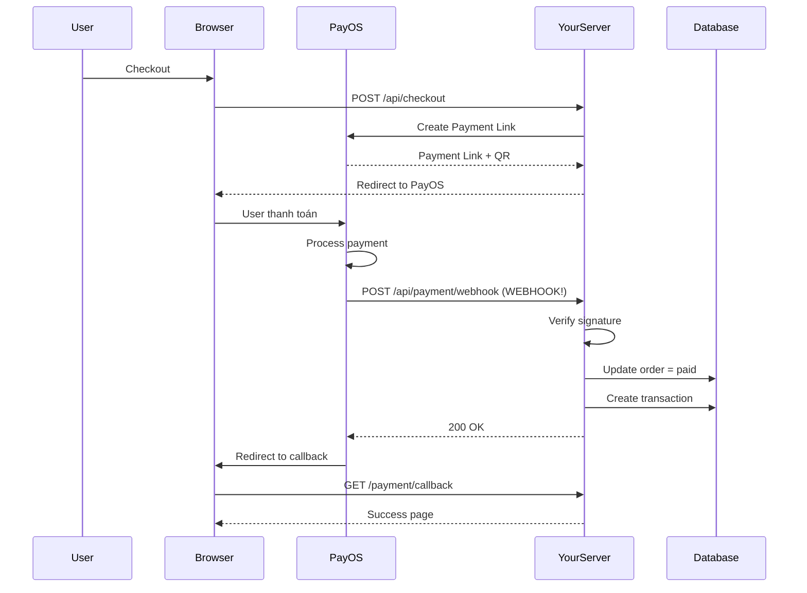

# PayOS Webhook Integration - Hướng Dẫn Chi Tiết

> **Nguồn**: PayOS API Documentation (latest)  
> **Support**: support@payos.vn  
> **URL**: https://payos.vn  
> **API Base**: https://api-merchant.payos.vn

---

## 📚 Tổng Quan Webhook PayOS

Webhook là cơ chế PayOS **tự động gửi thông báo** về server của bạn khi có sự kiện thanh toán xảy ra (thành công, thất bại, hủy).

### ✅ Lợi Ích Webhook

- **Real-time**: Nhận thông báo ngay lập tức khi thanh toán thành công
- **Đáng tin cậy**: Không phụ thuộc vào user có close browser hay không
- **Tự động**: Không cần polling status API liên tục
- **Bảo mật**: Có signature verification

---

## 🔧 Cấu Hình Webhook

### Bước 1: Xác Thực và Thêm Webhook URL

**API Endpoint:**
```
POST https://api-merchant.payos.vn/confirm-webhook
```

**Headers:**
```
x-client-id: YOUR_CLIENT_ID
x-api-key: YOUR_API_KEY
Content-Type: application/json
```

**Request Body:**
```json
{
  "webhookUrl": "https://your-domain.com/api/payment/webhook"
}
```

**Response Success (200):**
```json
{
  "code": "00",
  "desc": "success",
  "data": {
    "webhookUrl": "https://example.com/webhook",
    "accountNumber": "113366668888",
    "accountName": "QUY VAC XIN PHONG CHONG COVID",
    "name": "My Payment Channel",
    "shortName": "MPC"
  }
}
```

### ⚠️ Lưu Ý Quan Trọng

> [!WARNING]
> **Webhook URL Requirements:**
> - ✅ PHẢI là HTTPS (production)
> - ✅ PHẢI accessible từ internet
> - ❌ KHÔNG dùng `http://localhost` (không hoạt động)
> - ✅ For local test: Dùng **ngrok** để expose local server

**Error Codes:**
- `400`: Webhook URL invalid
- `401`: Missing API Key
- `5XX`: Lỗi từ server của bạn (webhook không phản hồi đúng)

---

## 📨 Webhook Request Format

Khi có thanh toán thành công, PayOS sẽ gửi **POST request** đến webhook URL của bạn:

### Request Body Structure

```json
{
  "code": "00",
  "desc": "success",
  "success": true,
  "data": {
    "orderCode": 123,
    "amount": 3000,
    "description": "VQRIO123",
    "accountNumber": "12345678",
    "reference": "TF230204212323",
    "transactionDateTime": "2023-02-04 18:25:00",
    "currency": "VND",
    "paymentLinkId": "124c33293c43417ab7879e14c8d9eb18",
    "code": "00",
    "desc": "Thành công",
    "counterAccountBankId": "",
    "counterAccountBankName": "",
    "counterAccountName": "",
    "counterAccountNumber": "",
    "virtualAccountName": "",
    "virtualAccountNumber": ""
  },
  "signature": "8d8640d802576397a1ce45ebda7f835055768ac7ad2e0bfb77f9b8f12cca4c7f"
}
```

### Data Fields Explanation

| Field | Type | Description |
|-------|------|-------------|
| `orderCode` | integer | Mã đơn hàng của bạn |
| `amount` | integer | Số tiền (VND) |
| `description` | string | Mô tả thanh toán |
| `reference` | string | **Mã giao dịch ngân hàng** (unique) |
| `transactionDateTime` | string | Thời gian giao dịch |
| `paymentLinkId` | string | ID payment link của PayOS |
| `counterAccountBankId` | string | Mã ngân hàng người chuyển |
| `counterAccountName` | string | Tên tài khoản người chuyển |

> [!IMPORTANT]
> **`reference`** là field quan trọng nhất - dùng để check idempotency (tránh duplicate processing)

---

## 🔐 Signature Verification

**CRITICAL**: PHẢI verify signature để đảm bảo request đến từ PayOS, không phải attacker.

### Algorithm: HMAC-SHA256

```typescript
import crypto from 'crypto';

function verifyWebhookSignature(
  webhookData: any,
  receivedSignature: string,
  checksumKey: string
): boolean {
  // Sắp xếp data theo alphabet và tạo string
  const sortedData = sortDataToString(webhookData.data);
  
  // Tạo signature từ checksumKey
  const computedSignature = crypto
    .createHmac('sha256', checksumKey)
    .update(sortedData)
    .digest('hex');
  
  // So sánh
  return computedSignature === receivedSignature;
}
```

### Ví Dụ Sort Data

```typescript
// webhookData.data
{
  orderCode: 123,
  amount: 3000,
  reference: "TF230204212323",
  // ... other fields
}

// Sorted string (theo alphabet)
"amount=3000&orderCode=123&reference=TF230204212323&..."
```

---

## 💻 Implementation trong Project

### File: `app/api/payment/webhook/route.ts`

**Code đã implement:**

```typescript
import { NextRequest, NextResponse } from 'next/server';
import { supabaseServer } from '@/lib/supabase-server';
import { verifyWebhookSignature } from '@/lib/payos';

export async function POST(request: NextRequest) {
    try {
        const webhookData = await request.json();
        
        console.log('PayOS webhook received:', webhookData);

        // 1. Verify signature
        const signature = request.headers.get('x-payos-signature') || '';
        const isValid = await verifyWebhookSignature(webhookData, signature);

        if (!isValid) {
            console.error('Invalid webhook signature');
            return NextResponse.json(
                { error: 'Invalid signature' },
                { status: 401 }
            );
        }

        // 2. Extract payment data
        const {
            orderCode,
            amount,
            reference,
            transactionDateTime,
            code,
        } = webhookData.data;

        // 3. Find order
        const { data: orders } = await supabaseServer
            .from('orders')
            .select('*')
            .ilike('order_id', `%${orderCode}%`)
            .limit(1);

        if (!orders || orders.length === 0) {
            return NextResponse.json(
                { error: 'Order not found' },
                { status: 404 }
            );
        }

        const order = orders[0];

        // 4. Validate amount
        if (order.total_amount !== amount) {
            console.error(`Amount mismatch: expected ${order.total_amount}, got ${amount}`);
            return NextResponse.json(
                { error: 'Amount mismatch' },
                { status: 400 }
            );
        }

        // 5. Check idempotency (tránh duplicate)
        const { data: existingTransaction } = await supabaseServer
            .from('transactions')
            .select('id')
            .eq('transaction_id', reference)
            .single();

        if (existingTransaction) {
            console.log('Webhook already processed:', reference);
            return NextResponse.json({ 
                success: true, 
                message: 'Already processed' 
            });
        }

        // 6. Update order status
        const orderStatus = code === '00' ? 'paid' : 'failed';

        await supabaseServer
            .from('orders')
            .update({
                status: orderStatus,
                paid_at: orderStatus === 'paid' ? new Date().toISOString() : null,
                transaction_id: reference,
            })
            .eq('order_id', order.order_id);

        // 7. Create transaction record
        await supabaseServer
            .from('transactions')
            .insert({
                order_id: order.order_id,
                transaction_id: reference,
                amount: amount,
                currency: 'VND',
                status: orderStatus === 'paid' ? 'success' : 'failed',
                payment_method: 'PAYOS',
                paid_at: orderStatus === 'paid' ? transactionDateTime : null,
                webhook_data: webhookData,
            });

        console.log(`✅ Order ${order.order_id} updated to ${orderStatus}`);

        // 8. Return 200 OK (QUAN TRỌNG!)
        return NextResponse.json({
            success: true,
            message: 'Webhook processed',
        });

    } catch (error) {
        console.error('Webhook error:', error);
        return NextResponse.json(
            { error: 'Internal server error' },
            { status: 500 }
        );
    }
}
```

### Key Points:

1. ✅ **Verify signature** - bảo mật
2. ✅ **Check idempotency** - tránh duplicate processing
3. ✅ **Validate amount** - đảm bảo số tiền đúng
4. ✅ **Return 200 OK ngay** - để PayOS biết đã nhận
5. ✅ **Log everything** - để debug

---

## 🧪 Testing Webhook

### Local Development với ngrok

**Step 1: Start ngrok**
```bash
# Terminal 1
npm run dev

# Terminal 2
ngrok http 3000
```

**Output:**
```
Forwarding: https://abc123.ngrok.io -> http://localhost:3000
```

**Step 2: Config webhook tại PayOS**

Dùng API hoặc PayOS dashboard:
```bash
curl -X POST https://api-merchant.payos.vn/confirm-webhook \
  -H "x-client-id: YOUR_CLIENT_ID" \
  -H "x-api-key: YOUR_API_KEY" \
  -H "Content-Type: application/json" \
  -d '{
    "webhookUrl": "https://abc123.ngrok.io/api/payment/webhook"
  }'
```

**Step 3: Test checkout flow**
1. Checkout trên localhost:3000
2. Thanh toán tại PayOS
3. Check terminal logs:
   ```
   ✅ PayOS webhook received: { ... }
   ✅ Order DH... updated to paid
   ```

**Step 4: Monitor ngrok**
- Open http://127.0.0.1:4040
- Xem webhook requests từ PayOS
- Check status code = 200

---

## 🚀 Production Deployment

### Step 1: Deploy to Vercel

```bash
git push origin main
# Vercel auto-deploy
```

### Step 2: Config Webhook URL

**Production URL:**
```
https://your-domain.com/api/payment/webhook
```

**Dùng API để update:**
```bash
curl -X POST https://api-merchant.payos.vn/confirm-webhook \
  -H "x-client-id: YOUR_CLIENT_ID" \
  -H "x-api-key: YOUR_API_KEY" \
  -H "Content-Type: application/json" \
  -d '{
    "webhookUrl": "https://your-domain.com/api/payment/webhook"
  }'
```

### Step 3: Verify

- Test checkout trên production
- Check Vercel logs: `vercel logs --follow`
- Verify order status updated

---

## 🔍 Troubleshooting

### Issue 1: Webhook không nhận được

**Check:**
- ✅ URL có accessible từ internet không? (test với curl)
- ✅ HTTPS enabled? (PayOS yêu cầu HTTPS cho production)
- ✅ Server có return 200 OK không?
- ✅ Check firewall/security groups

**Debug:**
```bash
# Test webhook endpoint
curl -X POST https://your-domain.com/api/payment/webhook \
  -H "Content-Type: application/json" \
  -d '{"test": "data"}'

# Should return 200 or 401 (signature invalid)
```

### Issue 2: Signature verification failed

**Causes:**
- ❌ Sai `PAYOS_CHECKSUM_KEY` trong .env
- ❌ Algorithm sai (phải dùng HMAC-SHA256)
- ❌ Data sorting sai

**Fix:**
```typescript
// Verify checksum key từ PayOS dashboard
console.log('Checksum key:', process.env.PAYOS_CHECKSUM_KEY);

// Log received vs computed signature
console.log('Received:', receivedSignature);
console.log('Computed:', computedSignature);
```

### Issue 3: Duplicate webhooks

**Cause:** PayOS retry nếu không nhận 200 OK nhanh

**Solution:**
- ✅ Check idempotency bằng `reference` field
- ✅ Return 200 OK ngay, xử lý async nếu phức tạp
- ✅ Đã implement trong code (line 66-76)

---

## 📊 Webhook Data Flow



---

## 🎯 Best Practices

### ✅ DO:

1. **Always verify signature** - bảo mật
2. **Check idempotency** - tránh duplicate
3. **Return 200 OK quickly** - PayOS sẽ retry nếu timeout
4. **Log webhook data** - để debug
5. **Validate amount** - đảm bảo không bị manipulate
6. **Use HTTPS** - PayOS yêu cầu production

### ❌ DON'T:

1. **Không skip signature verification** - nguy hiểm
2. **Không process slow logic trong webhook** - có thể timeout
3. **Không hardcode webhook URL** - dùng env variable
4. **Không ignore duplicate webhooks** - sẽ tạo duplicate orders
5. **Không log sensitive data** - bảo mật

---

## 📝 Checklist Triển Khai

### Development:
- [ ] Install ngrok
- [ ] Start ngrok: `ngrok http 3000`
- [ ] Config webhook với ngrok URL
- [ ] Test checkout flow
- [ ] Verify webhook logs
- [ ] Check database updates

### Production:
- [ ] Deploy to Vercel
- [ ] Config environment variables
- [ ] Update webhook URL (HTTPS)
- [ ] Test production checkout
- [ ] Monitor Vercel logs
- [ ] Setup error alerting

---

## 📞 Support

**PayOS Support:**
- Email: support@payos.vn
- Docs: https://payos.vn/docs
- Dashboard: https://my.payos.vn

**Debug Resources:**
- Ngrok Dashboard: http://127.0.0.1:4040
- Vercel Logs: `vercel logs --follow`
- Supabase Logs: Dashboard → Logs

---

**Last Updated:** 2026-01-15  
**Version:** 1.0  
**Status:** Production Ready ✅
