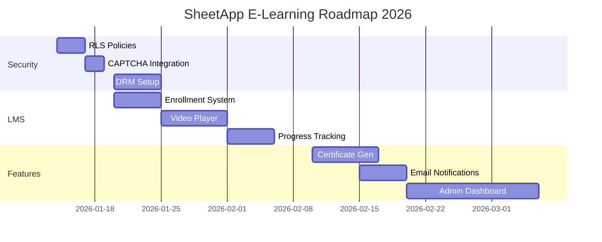

# 📊 BÁO CÁO TỔNG QUAN DỰ ÁN E-LEARNING SHEETAPP

> **Ngày tạo**: 2026-01-14  
> **Mục đích**: Tổng hợp toàn bộ vấn đề bảo mật, cấu trúc database, khối lượng công việc và kế hoạch tiếp theo  
> **Trạng thái**: Đang phát triển (Development Phase)

---

## 📑 MỤC LỤC

1. [Tổng quan dự án](#1-tổng-quan-dự-án)
2. [Bảo mật hệ thống](#2-bảo-mật-hệ-thống)
3. [Cấu trúc Database](#3-cấu-trúc-database)
4. [Tình trạng hiện tại](#4-tình-trạng-hiện-tại)
5. [Kế hoạch tiếp theo](#5-kế-hoạch-tiếp-theo)
6. [Bảo vệ chống sao chép nội dung](#6-bảo-vệ-chống-sao-chép-nội-dung)
7. [Roadmap triển khai](#7-roadmap-triển-khai)

---

## 1. TỔNG QUAN DỰ ÁN

### 1.1 Thông tin cơ bản

| Thông tin | Chi tiết |
|-----------|----------|
| **Tên dự án** | SheetApp - Nền tảng E-Learning |
| **Mục tiêu** | Nền tảng dạy và học online về Google Sheets, AppSheet, Automation, Web Development |
| **Tech Stack** | Next.js 16.1.1, React 19, TypeScript, Supabase, Tailwind CSS |
| **Database** | PostgreSQL (Supabase) |
| **Payment Gateway** | PayOS (đã tích hợp) |
| **Hosting** | Vercel (dự kiến) |

### 1.2 Chức năng chính

#### ✅ Đã hoàn thành
- [x] Đăng ký/Đăng nhập (Google OAuth)
- [x] Danh mục khóa học và dịch vụ
- [x] Giỏ hàng (Cart)
- [x] Thanh toán online (PayOS integration)
- [x] Responsive design (Mobile + Desktop)
- [x] SEO optimization
- [x] Search & Filter

#### 🚧 Đang phát triển
- [ ] Learning Management System (LMS)
- [ ] Video player cho bài học
- [ ] Progress tracking
- [ ] Certificate generation
- [ ] Email notifications
- [ ] Admin dashboard

#### 📋 Chưa bắt đầu
- [ ] Live streaming
- [ ] Discussion forum
- [ ] Gamification
- [ ] Mobile app (React Native)
- [ ] Affiliate system

---

## 2. BẢO MẬT HỆ THỐNG

### 2.1 Điểm bảo mật hiện tại: **6.5/10** 🟠

#### ✅ Đã triển khai

| Biện pháp | Trạng thái | Ghi chú |
|-----------|------------|---------|
| **Rate Limiting** | ✅ Implemented | Upstash Redis (lib/ratelimit.ts) |
| **Input Validation** | ✅ Implemented | DOMPurify + Validator (lib/validators.ts) |
| **CSRF Protection** | ✅ Implemented | lib/csrf.ts |
| **PayOS Integration** | ✅ Implemented | Webhook + Signature verification |
| **SSL/HTTPS** | ✅ Ready | Vercel auto-provision |
| **Environment Variables** | ✅ Secured | Server-only API routes |

#### ⚠️ Cần cải thiện

| Vấn đề | Mức độ | Giải pháp |
|--------|--------|-----------|
| **Row Level Security (RLS)** | 🔴 CRITICAL | Enable RLS policies cho tất cả tables |
| **Session Management** | 🟠 HIGH | Implement session timeout (24h) |
| **Password Policy** | 🟠 HIGH | Enforce strong password requirements |
| **Content Security** | 🟡 MEDIUM | Thêm DRM cho video lessons |
| **Audit Logging** | 🟡 MEDIUM | Track admin actions |

---

### 2.2 Bảo mật thanh toán

#### ✅ PayOS Integration (Completed)

**Files đã triển khai:**
- `lib/payos.ts` - PayOS client wrapper
- `app/api/checkout/route.ts` - Checkout API
- `app/api/payment/webhook/route.ts` - Payment webhook
- `app/api/payment/status/[orderId]/route.ts` - Status polling

**Tính năng:**
- ✅ Dynamic QR code generation
- ✅ Unique order ID (DH + timestamp)
- ✅ Webhook signature verification
- ✅ Transaction logging
- ✅ 15-minute payment expiration
- ✅ Server-side price validation

**Security measures:**
```typescript
// lib/payos.ts
- Checksum validation
- Webhook signature verification
- Secure credential storage

// lib/validators.ts
- Email, phone, name sanitization
- XSS prevention
- Spam keyword detection
```

---

### 2.3 Chống spam và bot

#### ✅ Rate Limiting (Implemented)

**Cấu hình:** `lib/ratelimit.ts`

```typescript
// Authentication endpoints: 5 requests / 15 minutes
authRateLimit: 5 req/15min

// General API: 100 requests / minute
apiRateLimit: 100 req/min

// Form submissions: 3 / hour
formRateLimit: 3 req/hour
```

**Áp dụng:**
- Login/Register
- Checkout
- Contact forms
- Review submissions

#### 📋 Cần thêm

- [ ] **CAPTCHA** - Google reCAPTCHA v3 cho form đăng ký
- [ ] **Honeypot fields** - Hidden fields để catch bots
- [ ] **IP Geoblocking** - Block high-risk countries
- [ ] **Device fingerprinting** - Track suspicious devices

---

### 2.4 Bảo mật website

#### ✅ Đã có

| Biện pháp | Trạng thái | Chi tiết |
|-----------|------------|----------|
| **HTTPS** | ✅ | Vercel auto-SSL |
| **CORS** | ✅ | Next.js middleware |
| **XSS Protection** | ✅ | DOMPurify sanitization |
| **CSRF Token** | ✅ | lib/csrf.ts |
| **SQL Injection** | ✅ | Supabase parameterized queries |
| **Rate Limiting** | ✅ | Upstash Redis |

#### 🔧 Cần cấu hình

```typescript
// next.config.ts - Security headers
{
  headers: [
    {
      source: '/:path*',
      headers: [
        { key: 'X-Frame-Options', value: 'DENY' },
        { key: 'X-Content-Type-Options', value: 'nosniff' },
        { key: 'Referrer-Policy', value: 'strict-origin-when-cross-origin' },
        { key: 'Permissions-Policy', value: 'camera=(), microphone=(), geolocation=()' },
      ],
    },
  ],
}
```

---

## 3. CẤU TRÚC DATABASE

### 3.1 Tổng quan

| Metric | Số lượng |
|--------|----------|
| **Tổng số tables** | 21 |
| **Foreign keys** | 10 |
| **Custom indexes** | 10+ |
| **RLS enabled** | 21/21 (100%) |

### 3.2 Core Tables (E-Learning)

#### 📚 Products & Courses

**`products`** - Sản phẩm/Khóa học chính
```sql
- id (bigint, PK)
- name (text)
- slug (text, UNIQUE)
- type (enum: 'course' | 'service')
- price (numeric)
- category_id (FK → categories)
- instructor_id (FK → instructors)
- thumbnail_url (text)
- is_active (boolean)
```

**`chapters`** - Chương học
```sql
- id (bigint, PK)
- product_id (FK → products)
- title (text)
- sort_order (int)
```

**`lessons`** - Bài học
```sql
- id (bigint, PK)
- chapter_id (FK → chapters)
- title (text)
- video_url (text)
- content (text)
- duration (int, seconds)
- is_preview (boolean)
- sort_order (int)
```

---

#### 💳 Orders & Payments

**`orders`** - Đơn hàng
```sql
- id (uuid, PK)
- order_id (text, UNIQUE) -- DH + timestamp
- user_id (uuid, FK → profiles) -- NULLABLE for guest
- customer_email (text) -- NEW: Guest checkout
- customer_name (text)  -- NEW: Guest checkout
- customer_phone (text) -- NEW: Guest checkout
- total_amount (numeric)
- status (enum: pending/paid/cancelled/expired)
- payment_link_id (text) -- PayOS link ID
- payment_url (text)
- payment_expires_at (timestamp)
- transaction_id (text)
- paid_at (timestamp)
- created_at (timestamptz)
```

**`order_items`** - Chi tiết đơn hàng (Normalized)
```sql
- id (bigint, PK)
- order_id (uuid, FK → orders.id)
- product_id (bigint, FK → products)
- quantity (int) -- NEW: Added
- price_at_purchase (numeric)
- created_at (timestamptz)
```

**`transactions`** - Giao dịch PayOS
```sql
- id (uuid, PK)
- order_id (text, FK → orders.order_id)
- transaction_id (text, UNIQUE)
- amount (numeric)
- status (text: pending/success/failed)
- payment_method (text)
- webhook_data (jsonb) -- Full PayOS payload
- created_at (timestamptz)
```

**Indexes:**
- `idx_orders_order_id` (UNIQUE)
- `idx_orders_status`
- `idx_orders_payment_link_id`
- `idx_transactions_transaction_id` (UNIQUE)
- `idx_transactions_status`

---

#### 👥 Users & Enrollment

**`profiles`** - Thông tin người dùng
```sql
- id (uuid, PK, FK → auth.users)
- email (text)
- full_name (text)
- avatar_url (text)
- phone (text)
- role (text: user/admin)
```

**`enrollments`** - Ghi danh khóa học (Cần tạo)
```sql
CREATE TABLE enrollments (
  id BIGSERIAL PRIMARY KEY,
  user_id UUID REFERENCES auth.users(id),
  product_id BIGINT REFERENCES products(id),
  order_id TEXT REFERENCES orders(order_id),
  enrolled_at TIMESTAMPTZ DEFAULT NOW(),
  progress INT DEFAULT 0,
  completed_at TIMESTAMPTZ,
  UNIQUE(user_id, product_id)
);
```

---

### 3.3 Row Level Security (RLS) Policies

#### ✅ Đã triển khai (File: `supabase_rls_policies.sql`)

**Products:**
```sql
-- Public read (active products only)
ON products FOR SELECT USING (is_active = true);

-- Admin only: INSERT/UPDATE/DELETE
ON products FOR ALL USING (auth.jwt()->>'role' = 'admin');
```

**Orders:**
```sql
-- Users view own orders
ON orders FOR SELECT 
USING (
  auth.uid() = user_id 
  OR user_email = (SELECT email FROM auth.users WHERE id = auth.uid())
);

-- Public can insert (guest checkout)
ON orders FOR INSERT WITH CHECK (true);
```

**Lessons:**
```sql
-- Preview lessons public
ON lessons FOR SELECT USING (is_preview = true);

-- Full access if enrolled (CẦN IMPLEMENT)
ON lessons FOR SELECT USING (
  is_preview = true OR
  EXISTS (
    SELECT 1 FROM enrollments 
    WHERE user_id = auth.uid() 
    AND product_id = (SELECT product_id FROM chapters WHERE id = lessons.chapter_id)
  )
);
```

---

## 4. TÌNH TRẠNG HIỆN TẠI

### 4.1 Khối lượng công việc đã hoàn thành

#### ✅ Phase 1: Foundation (100%)
- [x] Project setup (Next.js + TypeScript)
- [x] Database schema design
- [x] Authentication (Supabase OAuth)
- [x] Basic UI components
- [x] Responsive layout (Mobile + Desktop)

#### ✅ Phase 2: E-commerce (95%)
- [x] Product catalog
- [x] Search & Filter
- [x] Shopping cart
- [x] Checkout flow
- [x] PayOS integration
- [x] Payment webhook
- [ ] Email receipts (5%)

#### 🚧 Phase 3: Security (70%)
- [x] Rate limiting
- [x] Input validation
- [x] CSRF protection
- [x] Payment security
- [ ] RLS policies (30% - cần verify)
- [ ] CAPTCHA integration
- [ ] Content DRM

#### 📋 Phase 4: LMS (10%)
- [x] Database schema (chapters, lessons)
- [ ] Video player
- [ ] Progress tracking
- [ ] Enrollment system
- [ ] Certificate generation

---

### 4.2 Files đã triển khai

#### Core Library (`/lib`)
| File | Purpose | Status |
|------|---------|--------|
| `payos.ts` | PayOS client wrapper | ✅ Complete |
| `ratelimit.ts` | Rate limiting config | ✅ Complete |
| `validators.ts` | Input validation & sanitization | ✅ Complete |
| `csrf.ts` | CSRF token generation | ✅ Complete |
| `supabase.ts` | Supabase client | ✅ Complete |
| `supabase-server.ts` | Server-side Supabase | ✅ Complete |
| `constants.ts` | App configuration | ✅ Complete |

#### API Routes (`/app/api`)
| Route | Method | Purpose | Status |
|-------|--------|---------|--------|
| `/api/checkout` | POST | Create order + PayOS link | ✅ Complete |
| `/api/payment/webhook` | POST | PayOS webhook handler | ✅ Complete |
| `/api/payment/status/[orderId]` | GET | Poll payment status | ✅ Complete |
| `/api/verify-captcha` | POST | reCAPTCHA verification | 📋 Planned |
| `/api/products` | GET | Product listing | 📋 Planned |

#### Components
- ✅ Navbar, Footer, FloatingContact
- ✅ ProductCard, ProductActions
- ✅ Cart UI
- ✅ Checkout Multi-Step Form
- ✅ Payment Success/Failure pages
- 📋 Video Player (chưa có)
- 📋 Progress Tracker (chưa có)

---

### 4.3 Environment Variables

**Required (.env.local):**
```bash
# Supabase
NEXT_PUBLIC_SUPABASE_URL=https://xxx.supabase.co
NEXT_PUBLIC_SUPABASE_ANON_KEY=eyJhbGc...
SUPABASE_SERVICE_KEY=eyJhbGc... # Server-only

# PayOS
PAYOS_CLIENT_ID=xxx
PAYOS_API_KEY=xxx
PAYOS_CHECKSUM_KEY=xxx

# Upstash Redis (Rate Limiting)
UPSTASH_REDIS_REST_URL=https://xxx.upstash.io
UPSTASH_REDIS_REST_TOKEN=xxx

# App Config
NEXT_PUBLIC_BASE_URL=https://sheetapp.io.vn
```

---

## 5. KẾ HOẠCH TIẾP THEO

### 5.1 Immediate Priorities (0-7 ngày)

#### 🔴 CRITICAL - Bảo mật

**Task #1: Enable RLS Policies**
```bash
# File: supabase_rls_policies.sql
# Run trong Supabase SQL Editor

1. Verify current RLS status
2. Apply missing policies
3. Test with different user roles
4. Document policy logic
```

**Task #2: Guest Checkout Support**
```sql
-- Đã thêm columns:
- customer_email
- customer_name  
- customer_phone

-- User_id: NULLABLE (cho phép guest)
```

**Task #3: Add CAPTCHA**
```bash
npm install react-google-recaptcha-v3

# Files to update:
- app/login/page.tsx
- components/ConsultationModal.tsx
- app/api/verify-captcha/route.ts
```

---

### 5.2 Short-term (1-4 tuần)

#### 📚 Learning Management System

**Task #4: Enrollment System**
```typescript
// After successful payment webhook:
async function grantCourseAccess(orderId: string) {
  // 1. Get order items
  const { data: items } = await supabase
    .from('order_items')
    .select('product_id, order_id')
    .eq('order_id', orderId);

  // 2. Get user from order
  const { data: order } = await supabase
    .from('orders')
    .select('user_id')
    .eq('order_id', orderId)
    .single();

  // 3. Create enrollments
  for (const item of items) {
    await supabase.from('enrollments').insert({
      user_id: order.user_id,
      product_id: item.product_id,
      order_id: orderId,
    });
  }
}
```

**Task #5: Video Player**
```bash
npm install @vidstack/react

# Features:
- DRM protection
- Watermark overlay
- Screenshot prevention
- Speed control
- Quality selector
```

**Task #6: Progress Tracking**
```sql
CREATE TABLE user_progress (
  id BIGSERIAL PRIMARY KEY,
  user_id UUID REFERENCES auth.users(id),
  lesson_id BIGINT REFERENCES lessons(id),
  watched_duration INT, -- seconds
  completed BOOLEAN DEFAULT false,
  last_position INT, -- Resume playback
  updated_at TIMESTAMPTZ DEFAULT NOW(),
  UNIQUE(user_id, lesson_id)
);
```

---

### 5.3 Mid-term (1-3 tháng)

#### 🎓 Advanced LMS Features

- [ ] **Quizzes & Assignments**
- [ ] **Live Q&A sessions** (WebRTC)
- [ ] **Discussion forum** (per course)
- [ ] **Certificate generation** (PDF)
- [ ] **Email notifications** (SendGrid)
- [ ] **Admin CMS** (manage courses)

#### 💼 Business Features

- [ ] **Affiliate system** (commission tracking)
- [ ] **Coupon management** (đã có table)
- [ ] **Bulk enrollment** (corporate sales)
- [ ] **Analytics dashboard** (revenue, users, completion rate)

---

## 6. BẢO VỆ CHỐNG SAO CHÉP NỘI DUNG

### 6.1 Chống quay màn hình

#### ⚠️ Giới hạn kỹ thuật
**Không thể chặn 100%** quay màn hình vật lý (điện thoại quay màn hình laptop).

#### ✅ Có thể triển khai

**1. Disable Screen Capture API**
```typescript
// Component: VideoPlayer.tsx
useEffect(() => {
  // Prevent screenshots on supported browsers
  document.addEventListener('keyup', (e) => {
    if (e.key === 'PrintScreen') {
      navigator.clipboard.writeText('');
      alert('Screenshots are not allowed');
    }
  });

  // Prevent Inspect Element
  document.addEventListener('contextmenu', (e) => e.preventDefault());
  
  // Detect DevTools open
  const detectDevTools = () => {
    const threshold = 160;
    if (window.outerWidth - window.innerWidth > threshold ||
        window.outerHeight - window.innerHeight > threshold) {
      // Pause video or blur content
      videoRef.current?.pause();
    }
  };

  setInterval(detectDevTools, 1000);
}, []);
```

**2. Dynamic Watermark**
```typescript
// Overlay watermark với:
- User email
- Timestamp
- IP address
- Random position (mỗi 30s đổi vị trí)
- Semi-transparent (40% opacity)
```

**3. DRM Protection**
```bash
# Sử dụng Encrypted Media Extensions (EME)
npm install shaka-player

# Supported DRM:
- Widevine (Chrome, Firefox, Edge)
- FairPlay (Safari, iOS)
- PlayReady (IE, Edge)
```

**Example: Shaka Player with Widevine**
```typescript
import shaka from 'shaka-player/dist/shaka-player.ui';

const player = new shaka.Player(videoElement);
player.configure({
  drm: {
    servers: {
      'com.widevine.alpha': 'https://license-server.com/widevine',
    },
  },
});

await player.load('https://cdn.example.com/encrypted-video.mpd');
```

---

### 6.2 Chống sao chép khóa học

#### 🔒 Account & Session Control

**1. Giới hạn thiết bị đăng nhập**
```sql
CREATE TABLE user_sessions (
  id UUID PRIMARY KEY DEFAULT gen_random_uuid(),
  user_id UUID REFERENCES auth.users(id),
  device_fingerprint TEXT UNIQUE,
  ip_address TEXT,
  user_agent TEXT,
  last_active TIMESTAMPTZ DEFAULT NOW(),
  created_at TIMESTAMPTZ DEFAULT NOW()
);

-- Policy: Max 2 concurrent devices
CREATE POLICY "Max 2 active sessions per user"
ON user_sessions FOR INSERT
WITH CHECK (
  (SELECT COUNT(*) FROM user_sessions 
   WHERE user_id = NEW.user_id 
   AND last_active > NOW() - INTERVAL '30 minutes') < 2
);
```

**2. Tracking học tập bất thường**
```typescript
// Detect suspicious behavior:
- Watch speed > 2x consistently
- Multiple lessons completed in < 1 minute each
- Lessons watched out of order (all at once)
- IP địa chỉ thay đổi liên tục
```

**3. Enrollment validation**
```typescript
// middleware.ts
export async function middleware(req: NextRequest) {
  const { pathname } = req.nextUrl;

  if (pathname.startsWith('/learn/')) {
    const session = await getSession(req);
    if (!session) return NextResponse.redirect('/login');

    const courseSlug = pathname.split('/')[2];
    const hasAccess = await checkEnrollment(session.user.id, courseSlug);

    if (!hasAccess) {
      return NextResponse.redirect('/courses?error=not_enrolled');
    }
  }

  return NextResponse.next();
}
```

---

### 6.3 Content Protection Checklist

| Biện pháp | Mức độ bảo vệ | Độ khó triển khai | Ưu tiên |
|-----------|---------------|-------------------|---------|
| **DRM Video** (Widevine) | 🟢 Cao | 🟠 Medium | 1 |
| **Dynamic Watermark** | 🟡 Medium | 🟢 Low | 2 |
| **Disable DevTools** | 🟡 Medium | 🟢 Low | 3 |
| **Session Limiting** | 🟢 Cao | 🟢 Low | 1 |
| **IP Tracking** | 🟡 Medium | 🟢 Low | 4 |
| **Legal Terms** | 🟢 Cao | 🟢 Low | 1 |

**Khuyến nghị:**

> **Kết hợp nhiều lớp bảo vệ** thay vì dựa vào 1 biện pháp duy nhất.  
> **Legal protection** (Terms of Service) quan trọng hơn technical protection.

---

## 7. ROADMAP TRIỂN KHAI

### 7.1 Timeline tổng thể



---

### 7.2 Week-by-Week Plan

#### ✅ Week 1 (Jan 14-20): Security Hardening
- [ ] Day 1-2: Run RLS migration script
- [ ] Day 3-4: Implement reCAPTCHA v3
- [ ] Day 5-7: Test payment flow end-to-end

#### 📚 Week 2 (Jan 21-27): LMS Foundation
- [ ] Day 1-2: Create enrollments table + policies
- [ ] Day 3-5: Build video player component (DRM)
- [ ] Day 6-7: Implement progress tracking

#### 🎓 Week 3 (Jan 28 - Feb 3): Content Protection
- [ ] Day 1-2: Dynamic watermark overlay
- [ ] Day 3-4: Session limiting (max 2 devices)
- [ ] Day 5-7: Integrate Widevine DRM

#### 📧 Week 4 (Feb 4-10): Automation
- [ ] Day 1-3: Email templates (SendGrid)
- [ ] Day 4-5: Auto-enrollment after payment
- [ ] Day 6-7: Certificate generation

---

### 7.3 Success Metrics

| Metric | Current | Target (3 months) |
|--------|---------|-------------------|
| **Security Score** | 6.5/10 | 9/10 |
| **Payment Success Rate** | N/A | 95%+ |
| **API Uptime** | N/A | 99.5% |
| **DRM Protection** | 0% | 100% |
| **Email Delivery** | 0% | 98%+ |
| **Certificate Issued** | 0 | Auto |

---

## 8. TÀI LIỆU THAM KHẢO

### 8.1 Internal Docs

| Document | Path | Purpose |
|----------|------|---------|
| Technical Context | `_AI_DOCS/01_Technical_Context_Summary.md` | Full codebase overview |
| Security Audit | `_AI_DOCS/02_Security_Audit_Report.md` | 18 vulnerabilities analysis |
| Database Schema | `_AI_DOCS/Table_Construct.md` | 21 tables structure |
| Tasks List | `Tasks.md` | Prioritized task backlog |
| RLS Policies | `supabase_rls_policies.sql` | Database security rules |

### 8.2 External Resources

- **PayOS Docs**: https://payos.vn/docs
- **Supabase RLS Guide**: https://supabase.com/docs/guides/auth/row-level-security
- **Next.js Security**: https://nextjs.org/docs/advanced-features/security-headers
- **Widevine DRM**: https://developers.google.com/widevine
- **Shaka Player**: https://github.com/shaka-project/shaka-player

---

## 9. KẾT LUẬN

### ✅ Điểm mạnh hiện tại
- Kiến trúc rõ ràng, scalable
- PayOS integration hoàn chỉnh
- Security foundation tốt (rate limiting, validation)
- Database schema normalized đúng chuẩn

### ⚠️ Rủi ro cần khắc phục
- RLS policies chưa được verify đầy đủ
- Chưa có enrollment system (user mua rồi không access được khóa học)
- Video content chưa được protect (DRM)
- Email notifications chưa có

### 🎯 Mục tiêu 30 ngày tới
1. ✅ **Week 1**: Hoàn thiện security (RLS, CAPTCHA)
2. 📚 **Week 2**: Triển khai LMS cơ bản (enrollment, video player)
3. 🔒 **Week 3**: Content protection (DRM, watermark)
4. 📧 **Week 4**: Automation (email, certificates)

---

**Người tạo**: AI Assistant  
**Ngày cập nhật**: 2026-01-14  
**Version**: 1.0
