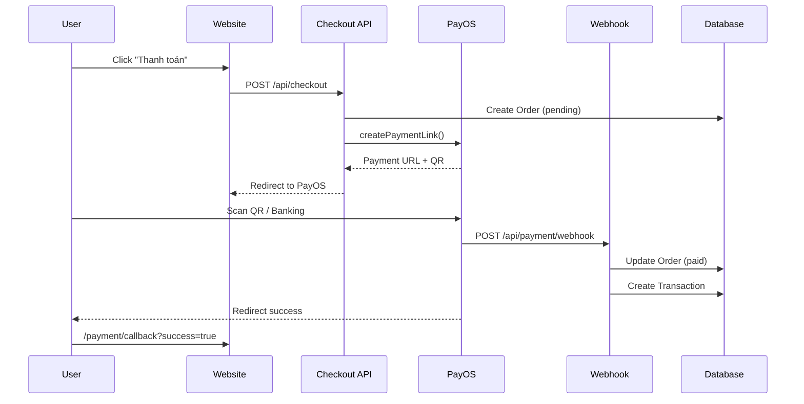

# 🛡️ BẢO MẬT VÀ CHỐNG SAO CHÉP NỘI DUNG

> **Chuyên đề**: Security & Content Protection  
> **Mức độ**: CRITICAL - Cần triển khai ngay  
> **Điểm số hiện tại**: 6.5/10

---

## 1. ĐÁNH GIÁ BẢO MẬT TỔNG THỂ

### 1.1 Security Scorecard

| Lĩnh vực | Điểm | Trạng thái | Độ ưu tiên |
|----------|------|------------|------------|
| **Payment Security** | 8/10 | ✅ Good | 🟢 Maintain |
| **API Security** | 7/10 | 🟡 Acceptable | 🟡 Improve |
| **Data Protection** | 5/10 | 🟠 Needs Work | 🔴 Critical |
| **Content DRM** | 2/10 | 🔴 Poor | 🔴 Critical |
| **Anti-Bot** | 6/10 | 🟡 Acceptable | 🟠 High |
| **Session Management** | 6/10 | 🟡 Acceptable | 🟠 High |

**Tổng điểm**: **6.5/10** 🟡

---

## 2. THANH TOÁN ONLINE - PayOS

### ✅ ĐÃ TRIỂN KHAI XONG

#### Payment Flow


#### Security Features Implemented

**1. Dynamic QR Code**
```typescript
// lib/payos.ts - Line 38
orderCode: Number(orderData.orderId.replace(/\D/g, '').slice(-9)),
amount: orderData.amount,
description: orderData.description,
expiredAt: Math.floor(Date.now() / 1000) + 15 * 60, // 15 min
```

✅ **Unique order ID**  
✅ **Amount validation**  
✅ **15-minute expiration**

**2. Webhook Security**
```typescript
// app/api/payment/webhook/route.ts
const signature = req.headers.get('x-signature');
const isValid = verifyWebhookSignature(webhookData, signature);

if (!isValid) {
  return NextResponse.json({ error: 'Invalid signature' }, { status: 401 });
}
```

✅ **Signature verification**  
✅ **Transaction logging**  
✅ **Idempotent processing** (prevent duplicate)

**3. Server-Side Price Validation**
```typescript
// app/api/checkout/route.ts
// Re-calculate from database, DON'T trust client
const { data: products } = await supabase
  .from('products')
  .select('id, price')
  .in('id', productIds);

let totalAmount = 0;
for (const item of items) {
  const realProduct = products.find(p => p.id === item.id);
  totalAmount += realProduct.price * item.quantity;
}
```

✅ **Cart manipulation prevention**

---

## 3. CHỐNG SPAM & BOT

### ✅ Rate Limiting (Upstash Redis)

**Cấu hình:** `lib/ratelimit.ts`

| Endpoint | Limit | Window | Purpose |
|----------|-------|--------|---------|
| `/api/login` | 5 requests | 15 min | Anti brute-force |
| `/api/checkout` | 10 requests | 10 min | Anti spam orders |
| `/api/*` (general) | 100 requests | 1 min | DDoS protection |
| Form submissions | 3 requests | 1 hour | Anti spam |

**Implementation:**
```typescript
import { authRateLimit, getClientIp } from '@/lib/ratelimit';

export async function POST(req: NextRequest) {
  const ip = getClientIp(req);
  const { success } = await authRateLimit.limit(ip);
  
  if (!success) {
    return NextResponse.json(
      { error: 'Too many requests' }, 
      { status: 429 }
    );
  }
  
  // Process request...
}
```

---

### ✅ Input Validation & Sanitization

**File:** `lib/validators.ts`

```typescript
import DOMPurify from 'isomorphic-dompurify';
import validator from 'validator';

// Email validation
validateEmail(email: string) {
  - Trim whitespace
  - Format validation
  - Normalize (lowercase)
}

// XSS prevention
validateMessage(message: string) {
  - DOMPurify sanitization
  - Spam keyword detection
  - Length limits (10-1000 chars)
  - Blocked keywords: viagra, casino, lottery...
}

// Phone validation (Vietnamese)
validatePhone(phone: string) {
  - 10 digits starting with 0
  - Pattern: 0[3-9]xxxxxxxx
}
```

---

### 📋 CHƯA TRIỂN KHAI - CAPTCHA

#### Khuyến nghị: Google reCAPTCHA v3

**Ưu điểm:**
- ✅ Invisible (không làm phiền UX)
- ✅ AI-powered scoring
- ✅ Free tier: 1 triệu requests/tháng

**Installation:**
```bash
npm install react-google-recaptcha-v3
```

**Implementation Plan:**

**1. Client Side** (`app/login/page.tsx`)
```typescript
import { GoogleReCaptchaProvider, useGoogleReCaptcha } from 'react-google-recaptcha-v3';

function LoginPage() {
  const { executeRecaptcha } = useGoogleReCaptcha();
  
  const handleLogin = async () => {
    if (!executeRecaptcha) return;
    
    const token = await executeRecaptcha('login');
    
    const res = await fetch('/api/login', {
      method: 'POST',
      body: JSON.stringify({ email, password, recaptchaToken: token }),
    });
  };
}

// Wrap app
export default function App() {
  return (
    <GoogleReCaptchaProvider rpcaptchaSiteKey="YOUR_SITE_KEY">
      <LoginPage />
    </GoogleReCaptchaProvider>
  );
}
```

**2. Server Side** (`app/api/verify-captcha/route.ts`)
```typescript
export async function POST(req: NextRequest) {
  const { token } = await req.json();
  
  const verifyUrl = `https://www.google.com/recaptcha/api/siteverify?secret=${process.env.RECAPTCHA_SECRET_KEY}&response=${token}`;
  
  const res = await fetch(verifyUrl, { method: 'POST' });
  const data = await res.json();
  
  if (data.success && data.score > 0.5) {
    return NextResponse.json({ verified: true });
  }
  
  return NextResponse.json({ verified: false, reason: 'Low score' });
}
```

**Forms cần CAPTCHA:**
- [ ] Login/Register
- [ ] Checkout
- [ ] Contact form
- [ ] Review submission

---

## 4. BẢO MẬT DATABASE

### ⚠️ Row Level Security (RLS)

**Current Status:** Policies đã define nhưng **CHƯA VERIFY**

#### Critical Tables

**`orders` - 5 policies**
```sql
-- ✅ Policy 1: Users view own orders
CREATE POLICY "Users view own orders"
ON orders FOR SELECT
USING (
  auth.uid() = user_id 
  OR user_email = (SELECT email FROM auth.users WHERE id = auth.uid())
);

-- ✅ Policy 2: Public can insert (guest checkout)
CREATE POLICY "Public can insert orders"
ON orders FOR INSERT
WITH CHECK (true);

-- ⚠️ RISK: Anyone can create unlimited orders!
-- FIX: Add rate limiting to checkout API
```

**`products` - 4 policies**
```sql
-- ✅ Public read active products
CREATE POLICY "Anyone can view active products"
ON products FOR SELECT
USING (is_active = true);

-- ✅ Admin only modify
CREATE POLICY "Only admins can update products"
ON products FOR UPDATE
USING (auth.jwt()->>'role' = 'admin');
```

**`lessons` - CRITICAL ⚠️**
```sql
-- ⚠️ MISSING: Enrollment check!
-- Current: Anyone can view lessons if is_preview = true
-- Need: Check if user enrolled in course

CREATE POLICY "Enrolled users can view lessons"
ON lessons FOR SELECT
USING (
  is_preview = true OR
  EXISTS (
    SELECT 1 FROM enrollments 
    WHERE user_id = auth.uid() 
    AND product_id = (
      SELECT product_id FROM chapters 
      WHERE id = lessons.chapter_id
    )
  )
);
```

#### Action Items

**Priority 1: Verify RLS**
```sql
-- Run from Supabase Dashboard
SELECT tablename, rowsecurity 
FROM pg_tables 
WHERE schemaname = 'public' 
AND tablename IN ('products', 'orders', 'lessons', 'enrollments');

-- Expected: rowsecurity = true for all
```

**Priority 2: Test với different users**
```javascript
// Test as anonymous user
const { data } = await supabase.from('orders').select('*');
// Should return empty or own orders only

// Test update as non-admin
const { error } = await supabase
  .from('products')
  .update({ price: 0 })
  .eq('id', 1);
// Should fail with "permission denied"
```

---

## 5. CHỐNG SAO CHÉP KHÓA HỌC

### 5.1 Session & Device Management

#### ⚠️ CHƯA TRIỂN KHAI

**Problem:**
- User mua 1 tài khoản
- Chia sẻ cho 10+ người cùng dùng
- Mất revenue

**Solution: Device Fingerprinting**

```sql
CREATE TABLE user_sessions (
  id UUID PRIMARY KEY DEFAULT gen_random_uuid(),
  user_id UUID REFERENCES auth.users(id),
  device_fingerprint TEXT, -- Browser fingerprint
  device_name TEXT, -- Chrome on Windows
  ip_address TEXT,
  last_active TIMESTAMPTZ DEFAULT NOW(),
  created_at TIMESTAMPTZ DEFAULT NOW(),
  UNIQUE(user_id, device_fingerprint)
);

-- Policy: Max 2 concurrent active sessions
CREATE POLICY "Max 2 devices per user"
ON user_sessions FOR INSERT
WITH CHECK (
  (SELECT COUNT(*) 
   FROM user_sessions 
   WHERE user_id = NEW.user_id 
   AND last_active > NOW() - INTERVAL '30 minutes'
  ) < 2
);
```

**Client Implementation:**
```typescript
// lib/device-fingerprint.ts
import FingerprintJS from '@fingerprintjs/fingerprintjs';

export async function getDeviceFingerprint() {
  const fp = await FingerprintJS.load();
  const result = await fp.get();
  return result.visitorId; // Unique device ID
}

// On login:
const deviceId = await getDeviceFingerprint();
await fetch('/api/auth/register-device', {
  method: 'POST',
  body: JSON.stringify({ deviceId }),
});
```

**Enforcement:**
```typescript
// middleware.ts
export async function middleware(req: NextRequest) {
  const session = await getSession(req);
  if (!session) return NextResponse.next();

  const deviceId = req.cookies.get('device_id')?.value;
  
  const { data: activeSession } = await supabase
    .from('user_sessions')
    .select('*')
    .eq('user_id', session.user.id)
    .eq('device_fingerprint', deviceId)
    .single();

  if (!activeSession) {
    // Check if max devices reached
    const { count } = await supabase
      .from('user_sessions')
      .select('*', { count: 'exact', head: true })
      .eq('user_id', session.user.id)
      .gt('last_active', new Date(Date.now() - 30 * 60 * 1000));

    if (count >= 2) {
      return NextResponse.redirect('/too-many-devices');
    }
  }

  return NextResponse.next();
}
```

---

### 5.2 Chống quay màn hình

#### ⚠️ GIỚI HẠN KỸ THUẬT

**Không thể chặn 100%:**
- ❌ Quay màn hình bằng điện thoại
- ❌ Screen recorder hardware (capture card)
- ❌ Virtual machine workarounds

**Có thể làm:**

#### 1. Dynamic Watermark ✅

```typescript
// components/VideoPlayer.tsx
function DynamicWatermark({ user }) {
  const [position, setPosition] = useState({ top: 10, left: 10 });

  useEffect(() => {
    // Change position every 30 seconds
    const interval = setInterval(() => {
      setPosition({
        top: Math.random() * 80 + 10,
        left: Math.random() * 80 + 10,
      });
    }, 30000);

    return () => clearInterval(interval);
  }, []);

  return (
    <div
      style={{
        position: 'absolute',
        top: `${position.top}%`,
        left: `${position.left}%`,
        opacity: 0.4,
        pointerEvents: 'none',
        fontSize: '14px',
        color: 'white',
        textShadow: '0 0 4px black',
        zIndex: 9999,
      }}
    >
      {user.email} | {new Date().toLocaleString()}
    </div>
  );
}
```

**Features:**
- User email + timestamp
- Random position mỗi 30s
- Semi-transparent (không che nội dung)
- Nếu quay lại → dễ identify người quay

---

#### 2. Disable Screenshot API ✅

```typescript
// components/VideoPlayer.tsx
useEffect(() => {
  // Prevent PrintScreen
  const handleKeyUp = (e: KeyboardEvent) => {
    if (e.key === 'PrintScreen') {
      navigator.clipboard.writeText('');
      alert('📸 Screenshots are disabled for this content');
    }
  };

  // Prevent Right-click
  const handleContextMenu = (e: MouseEvent) => {
    e.preventDefault();
    return false;
  };

  // Detect DevTools open
  const detectDevTools = () => {
    const widthThreshold = 160;
    const heightThreshold = 160;
    
    if (
      window.outerWidth - window.innerWidth > widthThreshold ||
      window.outerHeight - window.innerHeight > heightThreshold
    ) {
      videoRef.current?.pause();
      setDevToolsOpen(true);
    } else {
      setDevToolsOpen(false);
    }
  };

  document.addEventListener('keyup', handleKeyUp);
  document.addEventListener('contextmenu', handleContextMenu);
  const devToolsInterval = setInterval(detectDevTools, 1000);

  return () => {
    document.removeEventListener('keyup', handleKeyUp);
    document.removeEventListener('contextmenu', handleContextMenu);
    clearInterval(devToolsInterval);
  };
}, []);
```

**Hiệu quả:**
- 🟢 Chặn PrintScreen trên browser
- 🟢 Ngăn Inspect Element
- 🟡 Detect DevTools → pause video
- ❌ Không chặn được external tools (OBS, Bandicam)

---

#### 3. DRM Protection 🔴 CHƯA CÓ - CRITICAL

**Recommended: Widevine DRM**

**Setup Encrypted Video:**
```bash
# Step 1: Install Shaka Packager
npm install -g shaka-packager

# Step 2: Encrypt video files
packager \
  input=lesson-01.mp4,stream=video,output=lesson-01-video.mp4 \
  input=lesson-01.mp4,stream=audio,output=lesson-01-audio.mp4 \
  --enable_widevine_encryption \
  --key_server_url "https://license.uat.widevine.com/cenc/getcontentkey/widevine_test" \
  --content_id "lesson-01" \
  --mpd_output "lesson-01.mpd"
```

**Client Implementation:**
```typescript
// components/SecureVideoPlayer.tsx
import shaka from 'shaka-player/dist/shaka-player.ui';

export default function SecureVideoPlayer({ lessonId, manifestUrl }) {
  useEffect(() => {
    const video = videoRef.current;
    const player = new shaka.Player(video);

    // Configure DRM
    player.configure({
      drm: {
        servers: {
          'com.widevine.alpha': 'https://your-license-server.com/widevine',
        },
      },
    });

    // Load encrypted manifest
    player.load(manifestUrl).then(() => {
      console.log('✅ DRM video loaded');
    }).catch((error) => {
      console.error('❌ DRM error:', error);
    });

    return () => {
      player.destroy();
    };
  }, [manifestUrl]);

  return (
    <video ref={videoRef} controls autoPlay>
      Your browser doesn't support DRM playback.
    </video>
  );
}
```

**DRM Providers:**

| Provider | Cost | Features | Recommendation |
|----------|------|----------|----------------|
| **Widevine** (Google) | Free | Chrome, Firefox, Edge | ✅ Best |
| **FairPlay** (Apple) | Free | Safari, iOS | ✅ Recommended |
| **Azure Media Services** | $0.015/GB | Full stack | 🟡 Enterprise |
| **Vdocipher** | $49/mo | Ready-to-use | 🟢 Easiest |

---

## 6. CHECKLIST TRIỂN KHAI

### 🔴 CRITICAL (0-7 ngày)

- [ ] **Verify RLS policies** - Test với anonymous/user/admin roles
- [ ] **Add CAPTCHA** - reCAPTCHA v3 cho login/register/checkout
- [ ] **Implement enrollment check** - User chỉ access khóa đã mua

### 🟠 HIGH (1-4 tuần)

- [ ] **Device fingerprinting** - Limit 2 devices/account
- [ ] **Dynamic watermark** - Show user email + timestamp
- [ ] **DRM encryption** - Widevine cho video lessons
- [ ] **Session timeout** - Force logout sau 24h inactive

### 🟡 MEDIUM (1-3 tháng)

- [ ] **Audit logging** - Track admin actions
- [ ] **Suspicious activity detection** - Alert nếu watch speed > 2x
- [ ] **Legal protection** - Terms of Service, DMCA policy
- [ ] **IP tracking** - Log IP changes, geo-location

---

## 7. KẾT LUẬN

### Điểm mạnh ✅
- PayOS security tốt (webhook verification, dynamic QR)
- Rate limiting đã triển khai
- Input validation comprehensive
- CSRF protection có sẵn

### Cần cải thiện ⚠️
- RLS policies chưa được test kỹ
- Chưa có enrollment enforcement
- Content chưa được encrypt (DRM)
- Chưa có device limitation

### Ưu tiên cao nhất 🔴
1. **Enable + Test RLS** (1 ngày)
2. **Enrollment check middleware** (2 ngày)
3. **CAPTCHA integration** (1 ngày)
4. **DRM setup** (5 ngày)
5. **Device fingerprinting** (3 ngày)

**Target Score:** 9/10 sau 30 ngày

---

**Updated:** 2026-01-14  
**Version:** 1.0
